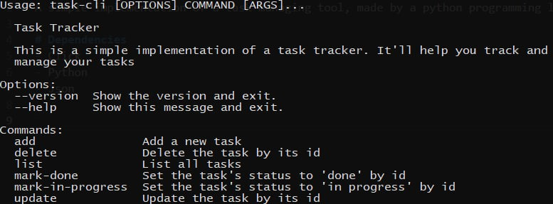

# Task Tracker


A simple implementation of a task managing tool, made in python programming language, with CLI interface

# Dependencies
- Click
- Python
- Json

# Features
- Add, Update and Delete Tasks
- Mark a task as in progress or done
- List all tasks
- List all tasks that are done
- List all tasks that are not done
- List all tasks that are in progress

# How to Run
1. Clone the main repostory
```
git clone https://github.com/MasoNord/Tiny-Project-Collection/tree/main
```
2. Navigate to the project folder
```
cd TaskTracker
```
3. Create a virtual environment
```
python -m venv venv
```
4. Activate the environment
```
./venv/Scripts/activate
```
5. Pack entry point
```
pip install -e .
```
6. Create a task.json file to keep your tasks
7. Run the app
```
task-cli
```

# Why is this project useful
- Gain some experience of working with click library for creating iteractice command line interfaces
- Practice working with json files 

# Source of Inspiration
https://roadmap.sh/projects/task-tracker
