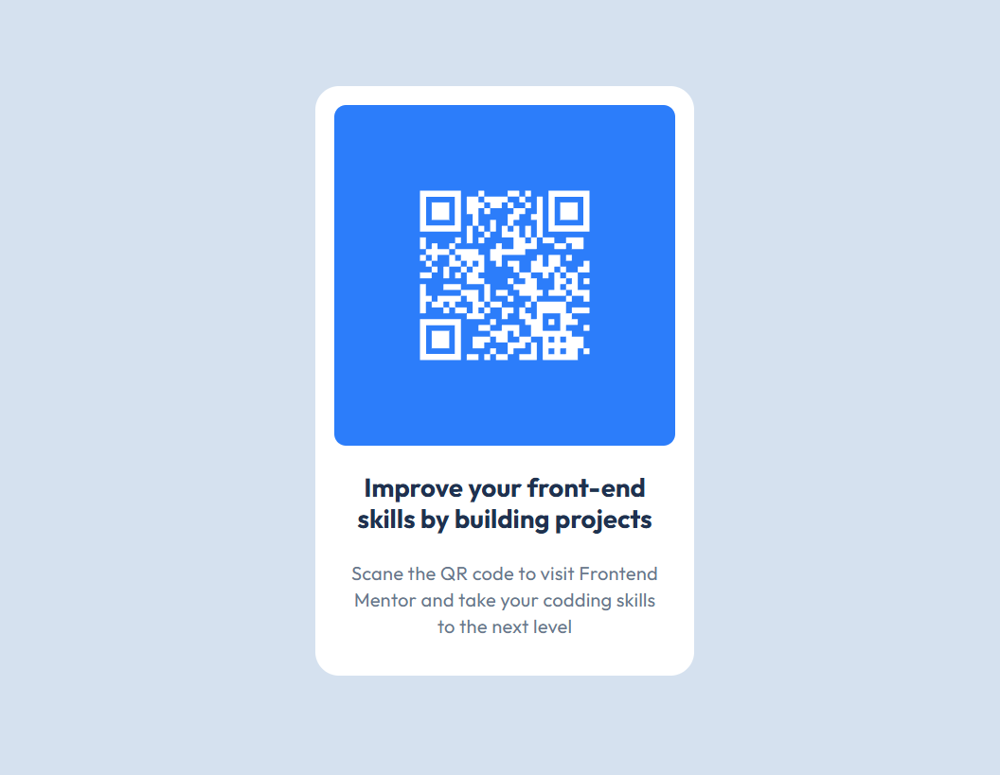

# Simple QR Code

It's a simple web page myde with HTML and CSS in order to apply new knowledges in action and gaine some experience in frontend development

# What I learned
- Building simple web apps with HTML and CSS
- Working with Figma
- Get some experience of working with *mdn web docs* documentation 
